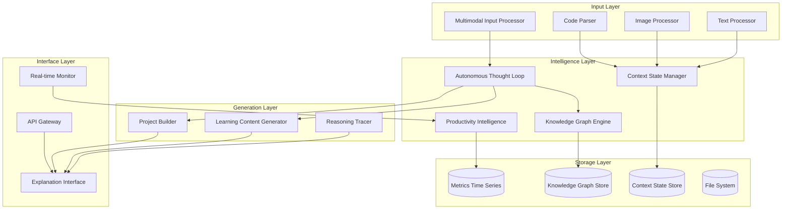

# Design Document: NEXUS.LAB

## Overview

NEXUS.LAB is designed as a sophisticated autonomous AI cognitive environment that creates a unified intelligence layer around the developer's workflow. The system operates through continuous multimodal input processing, dynamic knowledge graph management, and proactive intervention generation to enhance learning and productivity.

The architecture follows a microservices pattern with event-driven communication, enabling real-time processing of diverse input types while maintaining a coherent understanding of the user's project context and learning state. The system's core innovation lies in its Autonomous Thought Loop - a continuous background process that analyzes patterns, detects problems, and generates interventions before issues manifest.

Key design principles:
- **Multimodal Fusion**: Seamlessly integrate code, visual, and textual inputs into unified understanding
- **Proactive Intelligence**: Detect and prevent problems before they occur
- **Adaptive Learning**: Personalize content generation based on individual knowledge graphs
- **Transparent Reasoning**: Make AI decision-making processes visible and explorable
- **Continuous Monitoring**: Maintain real-time awareness of user state and project evolution

## Architecture

The NEXUS.LAB system employs a layered microservices architecture with the following core components:



### Component Responsibilities

**Input Layer**:
- Multimodal Input Processor: Orchestrates processing of diverse input types
- Code Parser: Extracts ASTs, dependencies, and semantic information from source code
- Image Processor: Performs OCR, object detection, and diagram recognition
- Text Processor: Handles natural language understanding and entity extraction

**Intelligence Layer**:
- Autonomous Thought Loop: Continuous analysis engine for problem detection and intervention planning
- Knowledge Graph Engine: Manages user knowledge state and learning progression
- Context State Manager: Maintains unified project and user understanding
- Productivity Intelligence: Tracks and analyzes productivity patterns and metrics

**Generation Layer**:
- Learning Content Generator: Creates personalized educational content and micro-lessons
- Project Builder: Generates project scaffolding, code, and architectural components
- Reasoning Tracer: Captures and visualizes AI decision-making processes

**Interface Layer**:
- Explanation Interface: Provides interactive exploration of AI reasoning and decisions
- Real-time Monitor: Delivers continuous monitoring and live feedback
- API Gateway: Manages external integrations and service communication

## Components and Interfaces

### Multimodal Input Processor

The Multimodal Input Processor serves as the primary entry point for all user inputs, coordinating specialized processors for different media types.

**Core Interface**:
```typescript
interface MultimodalInputProcessor {
  processInput(input: MultimodalInput): Promise<ProcessedInput>
  fuseInputs(inputs: ProcessedInput[]): Promise<ContextState>
  validateInput(input: MultimodalInput): ValidationResult
}

interface MultimodalInput {
  type: InputType
  content: Buffer | string
  metadata: InputMetadata
  timestamp: Date
}

enum InputType {
  CODE = 'code',
  IMAGE = 'image', 
  TEXT = 'text',
  DIAGRAM = 'diagram',
  SCHEMA = 'schema',
  LOG = 'log'
}
```

**Specialized Processors**:

*Code Parser*:
- Generates Abstract Syntax Trees for multiple programming languages
- Extracts dependency graphs and import relationships
- Identifies code patterns, anti-patterns, and potential issues
- Supports incremental parsing for real-time analysis

*Image Processor*:
- OCR engine for extracting text from screenshots and images
- Object detection for UI element identification
- Diagram recognition using computer vision models
- Error message extraction from visual content

*Text Processor*:
- Natural language understanding for requirements and descriptions
- Entity extraction for technical concepts and terminology
- Sentiment analysis for user frustration detection
- Context classification for appropriate response generation

### Knowledge Graph Engine

The Knowledge Graph Engine maintains a dynamic, personalized representation of the user's knowledge state, learning patterns, and skill progression.

**Core Interface**:
```typescript
interface KnowledgeGraphEngine {
  updateMastery(concept: string, evidence: MasteryEvidence): Promise<void>
  getMasteryLevel(concept: string): Promise<MasteryLevel>
  identifyGaps(requiredConcepts: string[]): Promise<KnowledgeGap[]>
  getPrerequisites(concept: string): Promise<string[]>
  correlateErrors(error: Error, concepts: string[]): Promise<void>
}

interface MasteryEvidence {
  type: EvidenceType
  strength: number
  context: string
  timestamp: Date
}

enum EvidenceType {
  CORRECT_USAGE = 'correct_usage',
  ERROR_PATTERN = 'error_pattern',
  EXPLANATION_REQUEST = 'explanation_request',
  SUCCESSFUL_APPLICATION = 'successful_application'
}
```

**Graph Structure**:
- Nodes represent concepts, skills, and knowledge areas
- Edges represent dependencies, prerequisites, and relationships
- Weights indicate mastery levels and confidence scores
- Temporal data tracks learning velocity and retention patterns

### Autonomous Thought Loop

The Autonomous Thought Loop operates as a continuous background process that analyzes the current context state, detects potential problems, and plans appropriate interventions.

**Core Interface**:
```typescript
interface AutonomousThoughtLoop {
  startMonitoring(): Promise<void>
  stopMonitoring(): Promise<void>
  analyzeContext(context: ContextState): Promise<Analysis>
  detectProblems(analysis: Analysis): Promise<Problem[]>
  planInterventions(problems: Problem[]): Promise<Intervention[]>
  executeIntervention(intervention: Intervention): Promise<void>
}

interface Problem {
  type: ProblemType
  severity: Severity
  description: string
  affectedComponents: string[]
  suggestedActions: Action[]
}

enum ProblemType {
  LOGICAL_ERROR = 'logical_error',
  ARCHITECTURAL_FLAW = 'architectural_flaw',
  SECURITY_VULNERABILITY = 'security_vulnerability',
  KNOWLEDGE_GAP = 'knowledge_gap',
  PERFORMANCE_ISSUE = 'performance_issue'
}
```

**Analysis Pipeline**:
1. Context Analysis: Evaluate current project state and user activity
2. Pattern Recognition: Identify recurring issues and anti-patterns
3. Risk Assessment: Calculate probability and impact of potential problems
4. Intervention Planning: Generate appropriate responses and timing
5. Execution Monitoring: Track intervention effectiveness and user response

### Context State Manager

The Context State Manager maintains a unified, real-time representation of the user's complete project context and current state.

**Core Interface**:
```typescript
interface ContextStateManager {
  updateContext(input: ProcessedInput): Promise<void>
  getCurrentContext(): Promise<ContextState>
  persistContext(): Promise<void>
  restoreContext(sessionId: string): Promise<ContextState>
  subscribeToChanges(callback: ContextChangeCallback): void
}

interface ContextState {
  projectState: ProjectState
  userState: UserState
  learningGoals: LearningGoal[]
  activeSession: SessionInfo
  lastUpdated: Date
}

interface ProjectState {
  codebase: CodebaseSnapshot
  architecture: ArchitecturalView
  dependencies: DependencyGraph
  issues: Issue[]
  metrics: ProjectMetrics
}
```

**State Synchronization**:
- Real-time updates from all input processors
- Conflict resolution for concurrent modifications
- Version control integration for change tracking
- Cross-session persistence with incremental updates

## Data Models

### Core Data Structures

**Knowledge Graph Node**:
```typescript
interface KnowledgeNode {
  id: string
  concept: string
  category: ConceptCategory
  masteryLevel: number // 0.0 to 1.0
  confidence: number // 0.0 to 1.0
  lastUpdated: Date
  evidence: MasteryEvidence[]
  prerequisites: string[]
  dependents: string[]
}

enum ConceptCategory {
  PROGRAMMING_LANGUAGE = 'programming_language',
  FRAMEWORK = 'framework',
  DESIGN_PATTERN = 'design_pattern',
  ALGORITHM = 'algorithm',
  ARCHITECTURE = 'architecture',
  TOOL = 'tool'
}
```

**Learning Content**:
```typescript
interface LearningContent {
  id: string
  type: ContentType
  concept: string
  duration: number // seconds
  difficulty: DifficultyLevel
  content: ContentBody
  prerequisites: string[]
  learningObjectives: string[]
  assessments: Assessment[]
}

enum ContentType {
  MICRO_LESSON = 'micro_lesson',
  INTERACTIVE_SIMULATOR = 'interactive_simulator',
  QUIZ = 'quiz',
  CODE_DRILL = 'code_drill'
}

interface ContentBody {
  text?: string
  code?: CodeExample[]
  diagrams?: Diagram[]
  interactions?: InteractiveElement[]
}
```

**Reasoning Trace**:
```typescript
interface ReasoningTrace {
  id: string
  decisionId: string
  timestamp: Date
  inputContext: ContextSnapshot
  reasoningSteps: ReasoningStep[]
  finalDecision: Decision
  confidence: number
  executionTime: number
}

interface ReasoningStep {
  stepId: string
  type: ReasoningType
  input: any
  output: any
  reasoning: string
  confidence: number
  alternatives: Alternative[]
}

enum ReasoningType {
  PATTERN_MATCHING = 'pattern_matching',
  LOGICAL_INFERENCE = 'logical_inference',
  SIMILARITY_SEARCH = 'similarity_search',
  RULE_APPLICATION = 'rule_application'
}
```

**Productivity Metrics**:
```typescript
interface ProductivityMetrics {
  sessionId: string
  userId: string
  timeRange: TimeRange
  taskCompletionTimes: TaskMetric[]
  errorPatterns: ErrorPattern[]
  focusMetrics: FocusMetric[]
  learningVelocity: LearningVelocityMetric[]
  efficiencyScore: number
}

interface TaskMetric {
  taskType: string
  averageTime: number
  completionRate: number
  errorRate: number
  improvementTrend: number
}

interface ErrorPattern {
  pattern: string
  frequency: number
  category: string
  averageResolutionTime: number
  knowledgeGapCorrelation: string[]
}
```

### Data Storage Strategy

**Knowledge Graph Store**:
- Graph database (Neo4j) for complex relationship queries
- Optimized for traversal and pattern matching operations
- Supports temporal queries for learning progression analysis
- Implements graph algorithms for prerequisite path finding

**Context State Store**:
- Document database (MongoDB) for flexible schema evolution
- Real-time synchronization with change streams
- Efficient querying for context retrieval and updates
- Automatic archival of historical states

**Metrics Time Series**:
- Time-series database (InfluxDB) for productivity analytics
- High-frequency data ingestion for real-time monitoring
- Efficient aggregation and downsampling for long-term trends
- Support for complex analytical queries and visualizations

**File System**:
- Distributed storage for generated content and artifacts
- Version control integration for code and project files
- Content delivery network for fast access to learning materials
- Backup and disaster recovery for critical user data

## Correctness Properties

*A property is a characteristic or behavior that should hold true across all valid executions of a system-essentially, a formal statement about what the system should do. Properties serve as the bridge between human-readable specifications and machine-verifiable correctness guarantees.*

Based on the prework analysis and property reflection, the following correctness properties ensure NEXUS.LAB operates correctly across all scenarios:

### Input Processing Properties

**Property 1: Multimodal Input Parsing Completeness**
*For any* valid source code file, the parsing process should produce a complete abstract syntax tree and dependency graph that accurately represents the code structure.
**Validates: Requirements 1.1**

**Property 2: OCR and Object Detection Accuracy**
*For any* error screenshot containing text and UI elements, the extraction process should identify all readable text and detectable UI components with their spatial relationships.
**Validates: Requirements 1.2**

**Property 3: Diagram Component Recognition**
*For any* valid system diagram, the recognition process should extract all diagram components and their relationships in a structured format.
**Validates: Requirements 1.3**

**Property 4: Schema Parsing Completeness**
*For any* valid database schema, the parsing process should extract all table structures, relationships, and constraints accurately.
**Validates: Requirements 1.4**

**Property 5: Log Pattern Extraction**
*For any* console log containing error patterns, the extraction process should identify all error patterns and stack traces with their contextual information.
**Validates: Requirements 1.5**

**Property 6: Input Fusion Consistency**
*For any* combination of multimodal inputs, the fusion process should produce a unified Context_State that preserves all essential information from individual inputs.
**Validates: Requirements 1.6**

### Knowledge Graph Properties

**Property 7: Mastery Level Updates**
*For any* concept and mastery evidence, updating the knowledge graph should result in appropriate mastery level changes that reflect the evidence strength and type.
**Validates: Requirements 2.1**

**Property 8: Error Pattern Recognition**
*For any* sequence of repeated errors in a specific area, the knowledge graph should mark the associated concept as weak or confused with appropriate confidence levels.
**Validates: Requirements 2.2**

**Property 9: Error-Gap Correlation**
*For any* user mistake, the analysis should correlate the error with specific knowledge gaps based on the error type and context.
**Validates: Requirements 2.3**

**Property 10: Prerequisite Identification**
*For any* new topic encountered, the system should identify all prerequisite concepts that are not yet learned according to the knowledge graph.
**Validates: Requirements 2.4**

**Property 11: Knowledge Graph Consistency**
*For any* knowledge graph state, all project-specific dependencies and concept relationships should remain consistent across all operations.
**Validates: Requirements 2.5**

**Property 12: Mastery Assessment Accuracy**
*For any* capability query, the returned mastery assessment should accurately reflect the current knowledge graph state for the queried concepts.
**Validates: Requirements 2.6**

### Problem Detection Properties

**Property 13: Logical Error Detection**
*For any* code containing logical errors, the Autonomous Thought Loop should detect the errors and generate appropriate pre-emptive warnings.
**Validates: Requirements 3.1**

**Property 14: Architectural Flaw Identification**
*For any* architectural pattern with identifiable flaws, the system should suggest specific architecture improvements.
**Validates: Requirements 3.2**

**Property 15: Security Vulnerability Alerting**
*For any* code containing security vulnerabilities, the system should alert the user with specific remediation steps.
**Validates: Requirements 3.3**

**Property 16: Misunderstanding Detection**
*For any* conceptual misunderstanding identified in user behavior, the system should trigger appropriate micro-lessons.
**Validates: Requirements 3.4**

**Property 17: Pattern-Based Fix Suggestions**
*For any* repeated error pattern, the system should suggest systematic fixes that address the root cause.
**Validates: Requirements 3.5**

**Property 18: Redundancy Detection**
*For any* code containing redundant patterns, the system should recommend specific refactoring opportunities.
**Validates: Requirements 3.6**

### Content Generation Properties

**Property 19: Adaptive Content Generation**
*For any* identified knowledge gap, the system should generate appropriate learning content (30-second explanations, 2-minute detailed explanations, interactive simulators, or assessments) based on the gap type and user needs.
**Validates: Requirements 4.1, 4.2, 4.3, 4.4**

**Property 20: Personalized Learning Path Generation**
*For any* knowledge graph state, the system should generate learning paths that respect prerequisite relationships and user mastery levels.
**Validates: Requirements 4.5**

**Property 21: Review Session Scheduling**
*For any* error history pattern, the system should schedule review sessions with appropriate timing and content based on the error frequency and recency.
**Validates: Requirements 4.6**

### Project Building Properties

**Property 22: Architecture Diagram Generation**
*For any* feature description, the system should generate architecture diagrams that appropriately represent the described functionality.
**Validates: Requirements 5.1**

**Property 23: Project Structure Generation**
*For any* project requirements, the system should create data models and API specifications that support the required functionality.
**Validates: Requirements 5.2**

**Property 24: Boilerplate Code Generation**
*For any* implementation context, the system should generate appropriate boilerplate code and configurations.
**Validates: Requirements 5.3**

**Property 25: Test Case Generation**
*For any* code requiring testing, the system should create comprehensive test cases that cover the code's functionality.
**Validates: Requirements 5.4**

**Property 26: Deployment Configuration Generation**
*For any* deployment scenario, the system should generate appropriate deployment steps and configurations.
**Validates: Requirements 5.5**

**Property 27: Solution Iteration**
*For any* user feedback on generated solutions, the system should iterate the solutions appropriately based on the feedback and project evolution.
**Validates: Requirements 5.6**

### Reasoning Transparency Properties

**Property 28: Reasoning Process Capture**
*For any* decision made by the system, the complete reasoning process should be captured and stored in a structured format.
**Validates: Requirements 6.1**

**Property 29: Visualization Generation**
*For any* system output (suggestions, relationships, logic flows, decisions, complexity analysis), appropriate visualizations should be generated that accurately represent the underlying data.
**Validates: Requirements 6.2, 6.3, 6.4, 6.5, 6.6**

### Productivity Intelligence Properties

**Property 30: Task Time Measurement**
*For any* development task, the system should accurately measure completion times within acceptable error margins.
**Validates: Requirements 7.1**

**Property 31: Error Pattern Classification**
*For any* set of errors, the system should classify and count repeated error types accurately.
**Validates: Requirements 7.2**

**Property 32: Focus and Friction Detection**
*For any* monitoring session, the system should detect focus drops and friction points based on behavioral indicators.
**Validates: Requirements 7.3**

**Property 33: Learning Velocity Tracking**
*For any* learning activity, the system should track learning velocity and concept mastery progression accurately.
**Validates: Requirements 7.4**

**Property 34: Insight and Analytics Generation**
*For any* daily activity data, the system should produce focus insights, efficiency scores, improvement plans, and skill-growth analytics.
**Validates: Requirements 7.5, 7.6**

### Context State Management Properties

**Property 35: Context State Merging**
*For any* multimodal input combination, the system should merge all signals into a unified Context_State that preserves essential information.
**Validates: Requirements 8.1**

**Property 36: Context Change Propagation**
*For any* Context_State change, all dependent components should be updated immediately and consistently.
**Validates: Requirements 8.2**

**Property 37: Context State Round-Trip**
*For any* Context_State, storing and then retrieving the context should restore the complete project understanding with all essential information preserved.
**Validates: Requirements 8.3, 8.4**

**Property 38: Context State Completeness**
*For any* Context_State, it should include current project status, user knowledge level, and active learning goals.
**Validates: Requirements 8.5**

**Property 39: Context State Refresh**
*For any* stale context scenario, the system should refresh the Context_State with current information appropriately.
**Validates: Requirements 8.6**

### Real-time Monitoring Properties

**Property 40: Real-time Analysis Consistency**
*For any* user activity (coding, learning, productivity measurement, behavior observation, skill development), the system should perform continuous analysis and updates in real-time with consistent accuracy.
**Validates: Requirements 9.1, 9.2, 9.3, 9.4, 9.5, 9.6**

### Interactive Interface Properties

**Property 41: Interactive Exploration Capabilities**
*For any* reasoning trace, decision tree, flow diagram, or heatmap, the system should provide appropriate interactive capabilities (drill-down, navigation, step-by-step viewing, hover details).
**Validates: Requirements 10.1, 10.2, 10.3, 10.4**

**Property 42: Multi-level Detail Support**
*For any* explanation review, the system should support multiple levels of detail from overview to deep-dive.
**Validates: Requirements 10.5**

**Property 43: Contextual Assistance**
*For any* interface element, the system should provide appropriate contextual assistance when help is accessed.
**Validates: Requirements 10.6**

## Error Handling

The NEXUS.LAB system implements comprehensive error handling across all components to ensure robust operation and graceful degradation:

### Input Processing Error Handling

**Malformed Input Recovery**:
- Invalid code files: Attempt partial parsing and provide diagnostic information
- Corrupted images: Fall back to alternative processing methods or request re-upload
- Unrecognizable diagrams: Provide manual annotation interface for user correction
- Invalid schemas: Highlight specific syntax errors and suggest corrections

**Processing Timeout Management**:
- Large file processing: Implement streaming and chunked processing
- Complex analysis operations: Provide progress indicators and cancellation options
- Resource exhaustion: Gracefully degrade to simpler processing methods

### Knowledge Graph Error Handling

**Consistency Maintenance**:
- Conflicting evidence: Implement confidence-weighted resolution algorithms
- Circular dependencies: Detect and break cycles while preserving valid relationships
- Data corruption: Maintain backup states and implement rollback mechanisms

**Performance Degradation**:
- Large graph operations: Implement pagination and lazy loading
- Complex queries: Provide approximate results with accuracy indicators
- Memory constraints: Implement graph partitioning and distributed processing

### Autonomous Thought Loop Error Handling

**Analysis Failures**:
- Incomplete context: Operate with available information and flag uncertainties
- Conflicting patterns: Present multiple hypotheses with confidence levels
- Resource limitations: Prioritize critical analysis and defer non-essential operations

**Intervention Failures**:
- User rejection: Learn from feedback and adjust future intervention strategies
- Timing conflicts: Queue interventions and present them at appropriate moments
- Content generation errors: Fall back to template-based or simplified content

### Real-time Monitoring Error Handling

**Data Collection Failures**:
- Network interruptions: Implement offline queuing and synchronization
- Sensor failures: Use alternative data sources and interpolation methods
- Storage failures: Implement redundant storage and graceful degradation

**Analysis Pipeline Failures**:
- Processing bottlenecks: Implement load balancing and priority queuing
- Model failures: Fall back to simpler analysis methods with reduced accuracy
- Memory leaks: Implement automatic cleanup and resource monitoring

## Testing Strategy

The NEXUS.LAB testing strategy employs a comprehensive dual approach combining unit testing for specific scenarios with property-based testing for universal correctness validation.

### Property-Based Testing Configuration

**Testing Framework**: Hypothesis (Python) for backend services, fast-check (TypeScript) for frontend components
**Test Configuration**: Minimum 100 iterations per property test to ensure comprehensive input coverage
**Property Test Tagging**: Each test references its corresponding design property using the format:
```
# Feature: nexus-lab, Property X: [Property Description]
```

### Unit Testing Strategy

**Focused Unit Testing**:
- Specific examples demonstrating correct behavior for each component
- Edge cases and boundary conditions for input processing
- Error conditions and recovery scenarios
- Integration points between microservices

**Testing Balance**:
- Property tests handle comprehensive input coverage and universal correctness
- Unit tests focus on concrete examples, edge cases, and integration scenarios
- Both approaches are complementary and necessary for complete validation

### Component-Specific Testing

**Multimodal Input Processor**:
- Property tests: Validate parsing completeness across all input types
- Unit tests: Test specific file formats, error recovery, and edge cases

**Knowledge Graph Engine**:
- Property tests: Verify consistency and accuracy across all graph operations
- Unit tests: Test specific update scenarios, query patterns, and performance

**Autonomous Thought Loop**:
- Property tests: Validate detection accuracy across all problem types
- Unit tests: Test specific intervention scenarios and timing logic

**Context State Manager**:
- Property tests: Verify state consistency and persistence across all operations
- Unit tests: Test specific synchronization scenarios and conflict resolution

**Real-time Monitoring**:
- Property tests: Validate continuous analysis accuracy across all activity types
- Unit tests: Test specific monitoring scenarios and performance metrics

### Integration Testing

**End-to-End Workflows**:
- Complete user journeys from input to intervention
- Cross-component communication and data flow validation
- Performance testing under realistic load conditions

**System Resilience**:
- Failure injection testing for error handling validation
- Load testing for scalability verification
- Security testing for vulnerability assessment

### Continuous Testing

**Automated Test Execution**:
- Property tests run on every code change with full iteration counts
- Unit tests provide rapid feedback during development
- Integration tests validate system behavior in staging environments

**Test Data Management**:
- Generated test data for property tests using appropriate distributions
- Curated test datasets for unit tests covering known scenarios
- Synthetic data generation for privacy-compliant testing